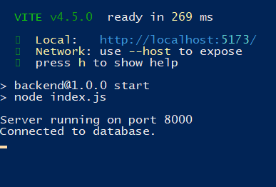

# melodeez
## Application user interface for music library <br>
### Requires node.js and npm to run <br>
### Instructions to run the application :
#### 1. Install packages by either running the install.bat script located in the root directory  <br> 
#### or <br> 
#### run the following commands in a command prompt<br><br>
> Open command prompt inside the root directory<br>
> ```cd ./frontend ``` // locate frontend directory<br>
> ```npm install ``` <br>
> ```cd ../backend ``` // locate backend directory<br>
> ```npm install ``` <br>
---
2. Run the server by executing these following commands in the command prompt
> Open cmd prompt inside the frontend directory<br>
> ```npm run both``` <br>
> You should see vite and express running <br>
> <br>
---

### If ports needed to be changed
- Locate "ports.js" in the backend folder
- Change the port numbers

      export const backPort = 8000;
      export const frontPort = 5173;
---

